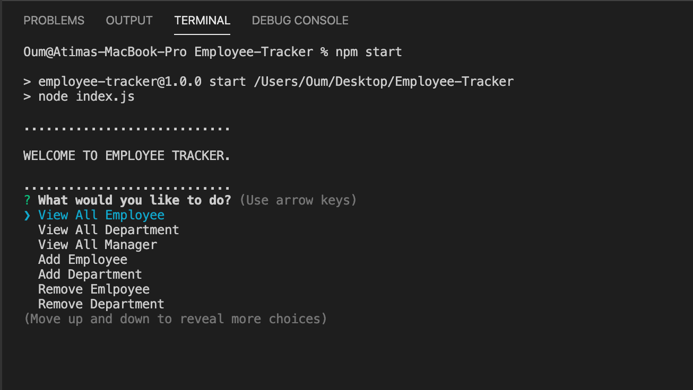
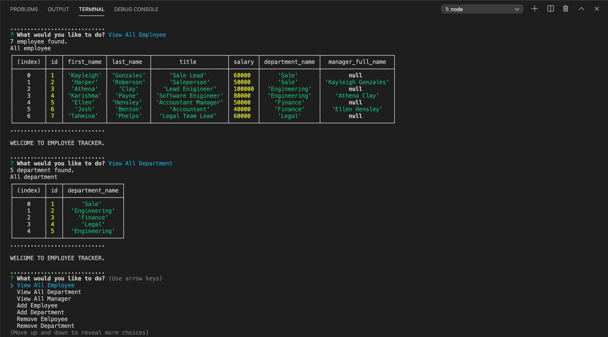

 

# Employee Tracker

This assignment I created an interfaces that make it easy for bussiness owner to view and interact with information stored in databases. by using node, inquirer, and MySQL.

## Table of Contents
* [Instructions](#instructions)
* [Installation](#installation)
* [Usage](#usage)
* [Resources](#resources)
* [Tests](#tests)

## Instructions
 This application will allowed the user to:
- View All Employee
- View All Department
- View All Manager
- Add Employee
- Add Department
- Remove Emlpoyee
- Remove Department

## Installation
  To install the necessary dependencies, run the following command.
   - Run `npm init` , `npm install inquirer`, `npm install mysql`.

## Usage
Type `npm start` or `node index.js` in console then the application will prompt the options.

## Resources
- [Learn SQL In 60 Minutes](https://youtu.be/p3qvj9hO_Bo)
- [MySQL Foreign Key](https://www.javatpoint.com/mysql-foreign-key)
- [MySQL foreign key examples (How to define foreign keys in MySQL)](http://alvinalexander.com/mysql/mysql-foreign-key-in-mysql-innodb-constraint/)
- [Name Generator](https://www.name-generator.org.uk/)
- [MySQL CONCAT( ) function](https://www.w3resource.com/mysql/string-functions/mysql-concat-function.php)

## Tests

